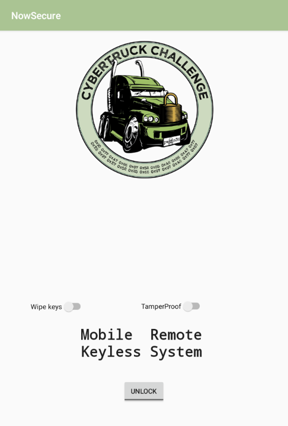
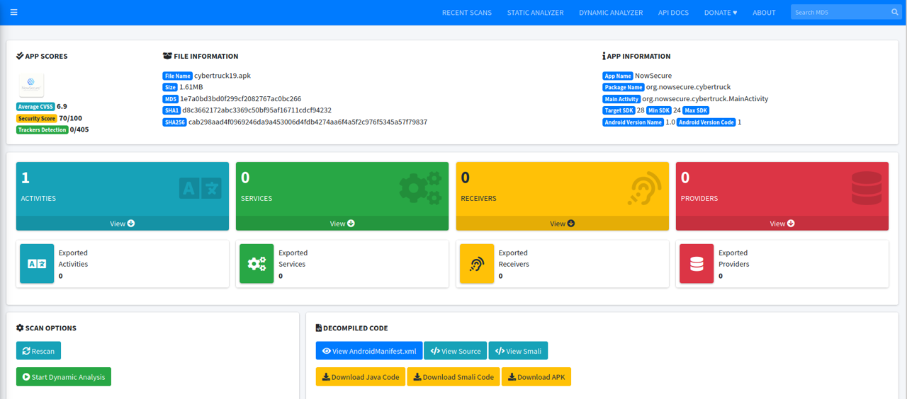
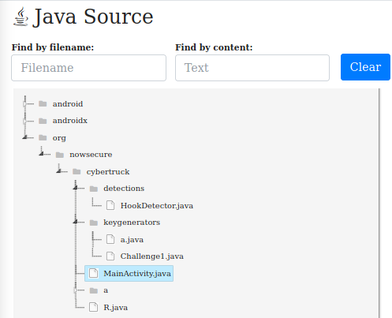

# Cybertruck Challenge 2019


<br>

## Prior Analysis

This is an Android Mobile-Pentesting and Reverse Engineering challenge that
I've just found. It's very interesting because the challenge involves
both static and dynamic analysis.

There are some tools that I used:
- [MobSF](https://github.com/MobSF/Mobile-Security-Framework-MobSF)
- [Frida](https://frida.re/docs/android/)
- [apktool](https://ibotpeaches.github.io/Apktool/)
- [Genymotion](https://www.genymotion.com)
- [IDA](https://hex-rays.com/ida-free/)

Altough there are other static analysis tools that can be used in this challenge,
such as Bytecode Viewer, Jadx-GUI, yet my preference is MobSF. I love how it
makes such structured conclusions including the source code of the APK.
Last but not least, to launch up the App, I use `Genymotion` for the emulator.

Our objective is to complete 3 challenges that are stated from Cybertruck Challenge's Git.

### Challenge1 to unlock car1. "DES key: Completely Keyless. Completely safe"

- `50pts`: There is a secret used to create a DES key. Can you tell me which one?

- `100pts`: There is a token generated at runtime to unlock the carid=1. Can you get it? (flag must be submitted in hexa all lowercase)


### Challenge2 to unlock car2: "AES key: Your Cell Mobile Is Your Key"

- `50pts`: This challenge has been obfuscated with ProGuard, therefore you will not recover the AES key.

- `100pts`: There is a token generated at runtime to unlock the carid=2. Can you get it? (flag must be submitted in hexa all lowercase)


###  Challenge3 to unlock car3. "Mr Truck: Unlock me Baby!"

- `50pts`: There is an interesting string in the native code. Can you catch it?


First, we need to decompile the APK using apktools with `d` flags to decompile
the APK.

```bash
apktool d cybertruck2019.apk
```

It'll then produce some folders and crucial files such as AndroidManifest.xml
which contains some of the APK permissions, exported functions, intents and
et centera.

```xml
<?xml version="1.0" encoding="utf-8" standalone="no"?><manifest xmlns:android="http://schemas.android.com/apk/res/android" android:compileSdkVersion="28" android:compileSdkVersionCodename="9" package="org.nowsecure.cybertruck" platformBuildVersionCode="28" platformBuildVersionName="9">
    <uses-permission android:name="android.permission.BLUETOOTH"/>
    <uses-permission android:name="android.permission.BLUETOOTH_ADMIN"/>
    <uses-permission android:name="android.permission.INTERNET"/>
    <uses-permission android:name="android.permission.ACCESS_NETWORK_STATE"/>
    <uses-permission android:name="android.permission.ACCESS_WIFI_STATE"/>
    <application android:allowBackup="true" android:appComponentFactory="android.support.v4.app.CoreComponentFactory" android:debuggable="true" android:icon="@mipmap/ic_launcher" android:label="@string/app_name" android:roundIcon="@mipmap/ic_launcher_round" android:supportsRtl="true" android:theme="@style/AppTheme">
        <activity android:name="org.nowsecure.cybertruck.MainActivity">
            <intent-filter>
                <action android:name="android.intent.action.MAIN"/>
                <category android:name="android.intent.category.LAUNCHER"/>
            </intent-filter>
        </activity>
    </application>
</manifest>
```

If we take a look at the Manifest file, there's only one intent in the APK which also
the entry point of the APK. It needs 5 permissions and allows backup.

Next, we can upload the APK to the MobSF Frameworks which can be run locally through the `run.sh` script
which available from the Git. It'll be launched on port 8000 by default.



We manage to find the decompiled SC section in the middle-right. Viewing the 
source code, leads to exposing the total classes that are used by the APK.



There are 6 classes (1 class in the `a` directory -> a.class) in the source code and one of them is by default exist, which
called `R.java`. This class contains some kind of value to be used from the APK
`res` files. It's likely to be resource managements, like `drawables`, `layouts`,
et centera.

Moving on to the MainActivity.java, there are some bullet points that we
will need to know.

```java
package org.nowsecure.cybertruck;

import android.content.Context;
import android.os.Bundle;
import android.os.CountDownTimer;
import android.support.v7.app.c;
import android.view.View;
import android.widget.Button;
import android.widget.CompoundButton;
import android.widget.Switch;
import android.widget.Toast;
import org.nowsecure.cybertruck.detections.HookDetector;
import org.nowsecure.cybertruck.keygenerators.Challenge1;
import org.nowsecure.cybertruck.keygenerators.a;

public class MainActivity extends c {
    private static Context j;

    static {
        System.loadLibrary("native-lib");
    }

    public native void init();

    /* access modifiers changed from: protected */
    public void k() {
        new Challenge1();
        new a(j);
        init();
    }

    /* access modifiers changed from: protected */
    @Override // android.support.v4.app.f, android.support.v4.app.x, android.support.v7.app.c
    public void onCreate(Bundle bundle) {
        j = getApplicationContext();
        super.onCreate(bundle);
        setContentView(R.layout.activity_main);
        ((Switch) findViewById(R.id.tamperproof)).setOnCheckedChangeListener(new CompoundButton.OnCheckedChangeListener() {
            /* class org.nowsecure.cybertruck.MainActivity.AnonymousClass1 */

            public void onCheckedChanged(CompoundButton compoundButton, boolean z) {
                if (z && new HookDetector().isFridaServerInDevice()) {
                    Toast.makeText(MainActivity.j, "Tampering detected!", 0).show();
                    new CountDownTimer(2000, 1000) {
                        /* class org.nowsecure.cybertruck.MainActivity.AnonymousClass1.AnonymousClass1 */

                        public void onFinish() {
                            System.exit(0);
                        }

                        public void onTick(long j) {
                        }
                    }.start();
                }
            }
        });
        ((Switch) findViewById(R.id.wipingkeys)).setOnCheckedChangeListener(new CompoundButton.OnCheckedChangeListener() {
            /* class org.nowsecure.cybertruck.MainActivity.AnonymousClass2 */

            public void onCheckedChanged(CompoundButton compoundButton, boolean z) {
                if (z) {
                    Toast.makeText(MainActivity.j, "Wiping keys...!", 0).show();
                }
            }
        });
        final Button button = (Button) findViewById(R.id.unlock_car);
        button.setOnClickListener(new View.OnClickListener() {
            /* class org.nowsecure.cybertruck.MainActivity.AnonymousClass3 */

            public void onClick(View view) {
                if (button != null) {
                    Toast.makeText(MainActivity.this.getApplicationContext(), "Unlocking cars...", 0).show();
                    MainActivity.this.k();
                }
            }
        });
        new org.nowsecure.cybertruck.a.a();
    }
}
```

## Challenge 1

Challenge1 Class is up!
Let's dive into the objective now. We need to find the secret which used in DES Key.
This one's pretty straightforward where we could just view the decompiled Challenge1.java
class and we can see the secret on the `generateDynamicKey` method.

Challenge1.java Source Code:

```java
package org.nowsecure.cybertruck.keygenerators;

import android.util.Log;
import java.security.InvalidKeyException;
import java.security.NoSuchAlgorithmException;
import java.security.spec.InvalidKeySpecException;
import javax.crypto.BadPaddingException;
import javax.crypto.Cipher;
import javax.crypto.IllegalBlockSizeException;
import javax.crypto.NoSuchPaddingException;
import javax.crypto.SecretKey;
import javax.crypto.SecretKeyFactory;
import javax.crypto.spec.DESKeySpec;

public class Challenge1 {
    private static final String TAG = "CyberTruckChallenge";

    public Challenge1() {
        generateKey();
    }

    /* access modifiers changed from: protected */
    public byte[] generateDynamicKey(byte[] bArr) {
        SecretKey generateSecret = SecretKeyFactory.getInstance("DES").generateSecret(new DESKeySpec("s3cr3t$_n3veR_mUst_bE_h4rdc0d3d_m4t3!".getBytes()));
        Cipher instance = Cipher.getInstance("DES");
        instance.init(1, generateSecret);
        return instance.doFinal(bArr);
    }

    /* access modifiers changed from: protected */
    public void generateKey() {
        Log.d(TAG, "KEYLESS CRYPTO [1] - Unlocking carID = 1");
        try {
            generateDynamicKey("CyB3r_tRucK_Ch4113ng3".getBytes());
        } catch (InvalidKeyException | NoSuchAlgorithmException | InvalidKeySpecException | BadPaddingException | IllegalBlockSizeException | NoSuchPaddingException e) {
            e.printStackTrace();
        }
    }
}
```

`Flag 1 (part 1) = s3cr3t$_n3veR_mUst_bE_h4rdc0d3d_m4t3!`

Now, there's a dynamic token that's generated in runtime when we're about to unlock
carid=1. Notice that the generateKey method must be the one which refers this
token creation since there's a prompt log of `Unlocking carID=1`. This token is
likely inherited from the generateDynamicKey method which pass a flag-like strings
which converted to bytes. The used-algorithm is DES.

Powering on our tools, `Frida` will save the day.
We can hook the generateDynamicKey and pass the bytes-type of "CyB3r_tRucK_Ch4113ng3"
to it and print out the result in **hex**.

There's a class which may be obstacle for us called HookDetector.
If we inspect further, it looks like naive-approach of `anti-frida`.

```java
package org.nowsecure.cybertruck.detections;
import android.util.Log;
import java.io.File;
public class HookDetector {
    private static final String TAG = "CyberTruckChallenge";
    private static final String classname = HookDetector.class.getSimpleName();
    public boolean isFridaServerInDevice() {
        if (!new File("/data/local/tmp/frida-server").exists() && !new File("/data/local/tmp/re.frida.server").exists() && !new File("/sdcard/re.frida.server").exists() && !new File("/sdcard/frida-server").exists()) {
            return false;
        }
        Log.d(TAG, "TAMPERPROOF [0] - Hooking detector trigger due to frida-server was found in /data/local/tmp/");
        return true;
    }
}
```

It searchs whether there are some files that are located in `tmp` directory and `sdcard`. If it exists, it'll return true to the caller.
Frida server is located on `tmp` by default. Thre are two approaches to bypass this class, whether we **rename** the original file of
frida server or we can hook and overwrite the function before the APK loads. Thus, we implemented the new functionality of
`isFridaInDevice` method with our version, which just return **False**.

Our script to use:

```javascript
Java.perform(function(){

	Java.use("org.nowsecure.cybertruck.detections.HookDetector").isFridaServerInDevice.implementation = function(){
		return false; //re-implement the method and just return false
	}


	var dynkey = Java.use("org.nowsecure.cybertruck.keygenerators.Challenge1").generateDynamicKey.overload("[B");
	dynkey.implementation = function(bytearr){
		var param = dynkey.call(this,bytearr); //originally pass CyB3r_tRucK_Ch4113ng3
		var hexed = toHexString(param); // convert the bytearray of the string to hex (hexlified)
		console.log("Dynamic Token: "+hexed);
		return param;

	}

	function toHexString(byteArray) {
  		return Array.from(byteArray, function(byte) {
    		return ('0' + (byte & 0xFF).toString(16)).slice(-2);
  		}).join('')
	}
});
```

Next up, we can fire up our frida and execute the script before the APK fully loads.

`frida -U "NowSecure" -l chall1.js --no-pause`

and we trigger the `Unlock` button for unlocking the carID=1 (since this button responsibles
for unlocking three of them).

```bash
frida -U "NowSecure" --no-pause -l chall1.js
     ____
    / _  |   Frida 15.0.9 - A world-class dynamic instrumentation toolkit
   | (_| |
    > _  |   Commands:
   /_/ |_|       help      -> Displays the help system
   . . . .       object?   -> Display information about 'object'
   . . . .       exit/quit -> Exit
   . . . .
   . . . .   More info at https://frida.re/docs/home/
                                                                         
[Google::NowSecure]-> Dynamic Token: 046e04ff67535d25dfea022033fcaaf23606
[Google::NowSecure]->
```

We manage to retrieve the token!
`Flag 1 (part 2) = 046e04ff67535d25dfea022033fcaaf23606`


## Challenge 2

We've the same objective as the prior challenge yet for the first part, it states that we
need to recover the AES Key. I was confused for a moment where I couldn't locate `Challenge2.java`
class but it turns out `a.java` contains the second challenge that we need to solve.

Looking at the decompiled source code:

```java
package org.nowsecure.cybertruck.keygenerators;

import android.content.Context;
import android.util.Log;
import java.io.BufferedReader;
import java.io.IOException;
import java.io.InputStream;
import java.io.InputStreamReader;
import java.security.InvalidKeyException;
import java.security.NoSuchAlgorithmException;
import javax.crypto.BadPaddingException;
import javax.crypto.Cipher;
import javax.crypto.IllegalBlockSizeException;
import javax.crypto.NoSuchPaddingException;
import javax.crypto.spec.SecretKeySpec;

public class a {
    public a(Context context) {
        try {
            a("uncr4ck4ble_k3yle$$".getBytes(), a(context));
        } catch (InvalidKeyException | NoSuchAlgorithmException | BadPaddingException | IllegalBlockSizeException | NoSuchPaddingException e) {
            e.printStackTrace();
        }
    }

    /* access modifiers changed from: protected */
    public byte[] a(Context context) {
        InputStream inputStream;
        Log.d("CyberTruckChallenge", "KEYLESS CRYPTO [2] - Unlocking carID = 2");
        StringBuilder sb = new StringBuilder();
        String str = null;
        try {
            inputStream = context.getAssets().open("ch2.key");
        } catch (IOException e) {
            e.printStackTrace();
            inputStream = null;
        }
        BufferedReader bufferedReader = new BufferedReader(new InputStreamReader(inputStream));
        while (true) {
            try {
                String readLine = bufferedReader.readLine();
                if (readLine == null) {
                    return sb.toString().getBytes();
                }
                str = readLine;
                sb.append(str);
            } catch (IOException e2) {
                e2.printStackTrace();
            }
        }
    }

    /* access modifiers changed from: protected */
    public byte[] a(byte[] bArr, byte[] bArr2) {
        SecretKeySpec secretKeySpec = new SecretKeySpec(bArr2, "AES");
        Cipher instance = Cipher.getInstance("AES/ECB/PKCS7Padding");
        instance.init(1, secretKeySpec);
        return instance.doFinal(bArr);
    }
}
```

This challenge has AES algorithm that's being used and we can see our cipher should be `uncr4ck4ble_k3yle$$`.
The main AES call located on the bottom and there's a method overloading in here, where the first `a` only
needs 1 parameter of context and the other one needs two byte-arrays likely.

The key is assigned to the inputStream variable and can be easily found on the assets folder of our decompiled
APK.

`cybertruckchallenge2019/apk/cybertruck2019/assets/ch2.key` = `d474_47_r357_mu57_pR073C73D700!!`

Thus, we got our first part of second flag.

`Flag 2 (part 1) = d474_47_r357_mu57_pR073C73D700!!`

The second objective is also the same as the part 2 of the prior challenge where we need to find the dynamic token
at runtime. We just need to modify the last frida script and select the right method overload which needs
2 byte-arrays parameters.

```javascript
Java.perform(function(){

	Java.use("org.nowsecure.cybertruck.detections.HookDetector").isFridaServerInDevice.implementation = function(){
		return false;
	}


	var dynkey = Java.use("org.nowsecure.cybertruck.keygenerators.Challenge1").generateDynamicKey.overload("[B");
	dynkey.implementation = function(bytearr){
		var param = dynkey.call(this,bytearr); //originally pass CyB3r_tRucK_Ch4113ng3
		var hexed = toHexString(param); // convert the bytearray of the string to hex (hexlified)
		console.log("Dynamic Token 1: "+hexed);
		return param;

	}

	var AES = Java.use("org.nowsecure.cybertruck.keygenerators.a").a.overload("[B","[B");
	AES.implementation = function(bytearr,bytearr2){
		var aes_param = AES.call(this,bytearr,bytearr2);
		var token_hexed = toHexString(aes_param); // convert the bytearray of the string to hex (hexlified)
		console.log("Dynamic Token 2: "+token_hexed);
		return aes_param;

	}

	function toHexString(byteArray) {
  		return Array.from(byteArray, function(byte) {
    		return ('0' + (byte & 0xFF).toString(16)).slice(-2);
  		}).join('')
	}
});
```

Running the script just like before will return:

```bash
frida -U "NowSecure" --no-pause -l chall1.js
     ____
    / _  |   Frida 15.0.9 - A world-class dynamic instrumentation toolkit
   | (_| |
    > _  |   Commands:
   /_/ |_|       help      -> Displays the help system
   . . . .       object?   -> Display information about 'object'
   . . . .       exit/quit -> Exit
   . . . .
   . . . .   More info at https://frida.re/docs/home/
                                                                                
[Google::NowSecure]-> Dynamic Token 1: 046e04ff67535d25dfea022033fcaaf23606b95a5c07a8c6
Dynamic Token 2: 512100f7cc50c76906d23181aff63f0d642b3d947f75d360b6b15447540e4f16
[Google::NowSecure]->

```

We manage to extract the dynamic token!

`Flag 2 (part 2) = 512100f7cc50c76906d23181aff63f0d642b3d947f75d360b6b15447540e4f16`

## Challenge 3

The last challenge contains only one part yet this should be the most satisfying one. I just realized
that the APK contains native lib where it states that there's a hidden strings over there.

We can extract the lib from the decompiled APK at cybertruckchallenge19/apk/cybertruck19/lib.
There are various arch support for the native-lib so I would choose the `x86_64` arch to debug
the shared library file (`.so`).

I'd like to try 3 approaches to extract this string.
As a reverse-engineer, we do static analysis with `strings` and we got the hidden strings pretty
straightforward.

```bash
strings libnative-lib.so
 
Android
5594570
*=)=*
__cxa_atexit
LIBC
libc.so
libnative-lib.so
__cxa_finalize
__register_atfork
Java_org_nowsecure_cybertruck_MainActivity_init
__android_log_print
__stack_chk_fail
strlen
_edata
__bss_start
_end
liblog.so
libm.so
libdl.so
CyberTruckChallenge
KEYLESS CRYPTO [3] - Unlocking carID = 3
Native_c0d3_1s_h4rd3r_To_r3vers3
...
```

The main JNI function names should be Java_org_nowsecure_cybertruck_MainActivity_init.

Let's try extracting them using IDA!

```assembly
push    rbp
mov     rbp, rsp
sub     rsp, 90h
mov     rax, fs:28h
mov     [rbp+var_8], rax
mov     [rbp+var_58], rdi
mov     [rbp+var_60], rsi
lea     rsi, aCybertruckchal ; "CyberTruckChallenge"
lea     rdx, aKeylessCrypto3 ; "KEYLESS CRYPTO [3] - Unlocking carID = "...
xor     ecx, ecx
mov     r8b, cl
mov     edi, 2
mov     al, r8b
call    ___android_log_print
movaps  xmm0, cs:xmmword_860
movaps  [rbp+var_20], xmm0
movaps  xmm0, cs:xmmword_850
movaps  xmmword ptr [rbp+s], xmm0
movaps  xmm0, cs:xmmword_880
movaps  [rbp+var_40], xmm0
movaps  xmm0, cs:xmmword_870
movaps  [rbp+var_50], xmm0
lea     rdi, [rbp+s]    ; s
mov     [rbp+var_7C], eax
call    _strlen
```

There's a call of strlen which also holds a pointer to the strings, let's inspect
the XMM Registers.

```assembly
.rodata:0000000000000824                                         ; DATA XREF: Java_org_nowsecure_cybertruck_MainActivity_init+27↑o
.rodata:000000000000084D                 align 10h
.rodata:0000000000000850 xmmword_850     xmmword 'h_s1_3d0c_evitaN'
.rodata:0000000000000850                                         ; DATA XREF: Java_org_nowsecure_cybertruck_MainActivity_init+4B↑r
.rodata:0000000000000860 xmmword_860     xmmword '3srev3r_oT_r3dr4'
.rodata:0000000000000860                                         ; DATA XREF: Java_org_nowsecure_cybertruck_MainActivity_init+40↑r
.rodata:0000000000000870 xmmword_870     xmmword 1F3332457B462914116F55120217002Ch
.rodata:0000000000000870                                         ; DATA XREF: Java_org_nowsecure_cybertruck_MainActivity_init+61↑r
.rodata:0000000000000880 xmmword_880     xmmword 17571C561257433D1D64191771170B00h
.rodata:0000000000000880                                         ; DATA XREF: Java_org_nowsecure_cybertruck_MainActivity_init+56↑r
.rodata:0000000000000880 _rodata         ends
```

As I thought, the hidden strings are located in `.rodata` sections of XMM Registers. We can reverse the strings and append
them back resulting the same strings from our first approach.

The third approach that I'll use is using Frida again. Sooner or later I'll update the result here.
Thank you for reading my writeups!