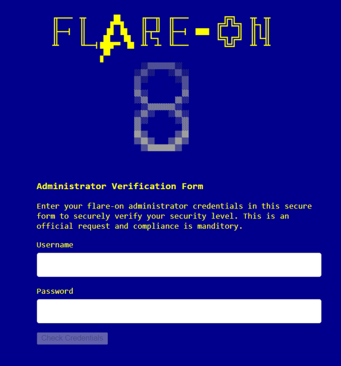

# Flare-On CTF 8

This year challenges are pretty fun, yet sadly I only have two days before Flare-On
events ended so only managed to solve two problems.

The first challenge consists of 1 HTML file with a credential verification. 



My approach is to take a peek on the source code of the website and understand the code
flows. This can be done by viewing the source code pages.
<br>
```javascript
<script>
var form = document.getElementById("credform");
var username = document.getElementById("usrname");
var password = document.getElementById("psw");
var info = document.getElementById("infolabel");
var checkbtn = document.getElementById("checkbtn");
var encoded_key = "P1xNFigYIh0BGAofD1o5RSlXeRU2JiQQSSgCRAJdOw=="

function dataEntered() {
	if (username.value.length > 0 && password.value.length > 0) {
		checkbtn.disabled = false;
	} else {
		checkbtn.disabled = true;
	}
}

function checkCreds() {
	if (username.value == "Admin" && atob(password.value) == "goldenticket") 
	{
		var key = atob(encoded_key);
		var flag = "";
		for (let i = 0; i < key.length; i++)
		{
			flag += String.fromCharCode(key.charCodeAt(i) ^ password.value.charCodeAt(i % password.value.length))
		}
		document.getElementById("banner").style.display = "none";
		document.getElementById("formdiv").style.display = "none";
		document.getElementById("message").style.display = "none";
		document.getElementById("final_flag").innerText = flag;
		document.getElementById("winner").style.display = "block";
	}
	else
	{
		document.getElementById("message").style.display = "block";
	}
}

</script>
```

From the source code, we can see that the username must be filled with `Admin` and the password is 
`goldenticket`. Yet, it won't prompt the flag since it only consists of some informations.
There's an encoded key variable and the flag as the `flag`'s placeholder.

The algorithm is pretty simple since it only XOR two values.
The `atob()` decodes the base64 string to regular string.

Final solver script:
```python
from pwn import xor
import base64

encoded_key = base64.b64decode("P1xNFigYIh0BGAofD1o5RSlXeRU2JiQQSSgCRAJdOw==")
base_golden = base64.b64encode(b"goldenticket")

print(xor(encoded_key,base_golden))
```

`Flag: enter_the_funhouse@flare-on.com`
