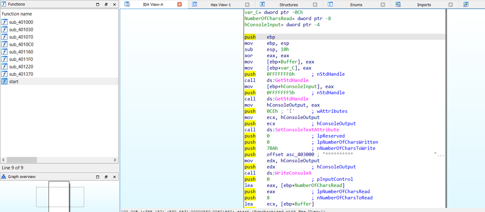
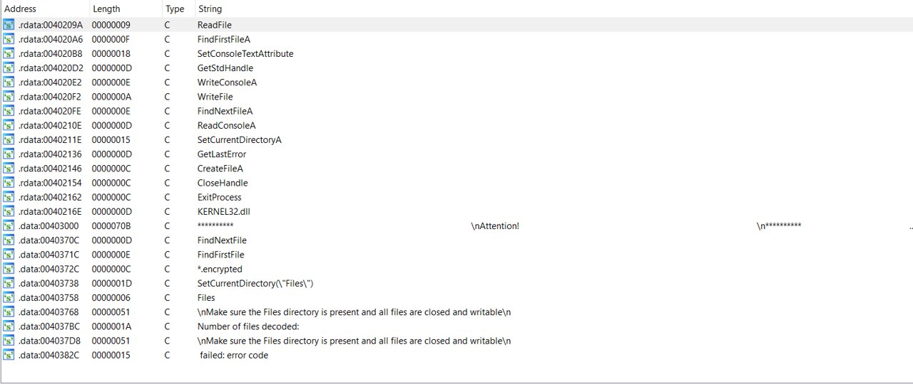

# Flare-On CTF Challenge #2

This challenge is a typical **ransomware** reversing with a bit manipulation
algorithm encryption. The scenario is that given an executed EXECUTABLES file which 
is the source of the ransomware, and also some encrypted files.

The goal is to recover the encrypted files. We can use IDA Pro to decompile the PE and understand
the logic of the encryption algorithm.
I used Flare-VM, which you can download it from this awesome repo -> https://github.com/mandiant/flare-vm.

It provides several tools for us to dynamically understand the malware behaviour and other tools which
may support our reversing activity.

# Static Approach Recon

Disassembling the PE to IDA Pro reveals a total of the functions that are used in the PE is 9 functions, including
the `entry point`.



Starting from the very basic approach, I tried to locate a several interesting strings from `String View`, we can see there's
a "ransom"-like message.




```assembly
.data:00403000                 db '                                            ',0Ah
.data:00403000                 db '**********                                                       '
.data:00403000                 db '                                            ',0Ah
.data:00403000                 db '                                                                 '
.data:00403000                 db '                                            ',0Ah
.data:00403000                 db 'Your documents, photos, and other important files have been encry'
.data:00403000                 db 'pted with a strong algorithm.               ',0Ah
.data:00403000                 db '                                                                 '
.data:00403000                 db '                                            ',0Ah
.data:00403000                 db 'Don',27h,'t try and change file extensions! It can be dangerous f'
.data:00403000                 db 'or the encrypted information!                     ',0Ah
.data:00403000                 db '                                                                 '
.data:00403000                 db '                                            ',0Ah
.data:00403000                 db 'The only way to recover (decrypt) your files is to run this decry'
.data:00403000                 db 'ptor with the unique private key.           ',0Ah
.data:00403000                 db 'Attention! Only we can recover your files! If someone tell you th'
.data:00403000                 db 'at he can do this, kindly ask him to proof! ',0Ah
.data:00403000                 db '                                                                 '
.data:00403000                 db '                                            ',0Ah
.data:00403000                 db 'Below you will see a big base64 blob, you will need to email us a'
.data:00403000                 db 'nd copy this blob to us.                    ',0Ah
.data:00403000                 db 'You must pay all but 1 BTC to 48 hours for recover it. After 48 h'
.data:00403000                 db 'ours we will leaked all your data!          ',0Ah
.data:00403000                 db '                                                                 '
.data:00403000                 db '                                            ',0Ah
.data:00403000                 db 'KD4wXzApPiBJdCdzIGRhbmdlcm91cyB0byBhZGQrcm9yIGFsb25lISBUYWtlIHRoa'
.data:00403000                 db 'XMgPCgwXzA8KQo=                             ',0Ah
.data:00403000                 db '                                                                 '
.data:00403000                 db '                                            ',0Ah
.data:00403000                 db 'Enter the decryption key and press Enter: ',0
.data:0040370B                 align 4
```

It prompts us the decryption key that we need to use in order to decrypt the files. Apart from that, we can analyze the
source code further.

# Decompiling PE

1) **Entry Point**

```c
void __noreturn start()
{
  UINT v0; // eax
  int Buffer[2]; // [esp+0h] [ebp-10h] BYREF
  DWORD NumberOfCharsRead; // [esp+8h] [ebp-8h] BYREF
  HANDLE hConsoleInput; // [esp+Ch] [ebp-4h]

  Buffer[0] = 0;
  Buffer[1] = 0;
  hConsoleInput = GetStdHandle(0xFFFFFFF6);
  hConsoleOutput = GetStdHandle(0xFFFFFFF5);
  SetConsoleTextAttribute(hConsoleOutput, 0xCEu);
  WriteConsoleA(hConsoleOutput, asc_403000, 0x70Au, 0, 0);
  ReadConsoleA(hConsoleInput, Buffer, 8u, &NumberOfCharsRead, 0);
  v0 = sub_401370(Buffer);
  ExitProcess(v0);
}
```
This function only prompts us the "ransom"-like message which located on 0x403000 with a total
0x70A bytes. The program then asks for our input which used `ReadConsoleA`.

```c
BOOL WINAPI ReadConsole(
  _In_     HANDLE  hConsoleInput,
  _Out_    LPVOID  lpBuffer,
  _In_     DWORD   nNumberOfCharsToRead,
  _Out_    LPDWORD lpNumberOfCharsRead,
  _In_opt_ LPVOID  pInputControl
);
```

According to the documentation, it reads our input and assigns the input to Buffer variable with a total
8 bytes, this indicates the **the key length is 8 bytes**. The PE used a lot of common WinAPI function, which
very-well documented on https://docs.microsoft.com/en-us/windows/.
It then transforms our buffer through a function call from `sub_401370`.

2) **sub_401370**

```c
BOOL __cdecl sub_401370(int a1)
{
  struct _WIN32_FIND_DATAA FindFileData; // [esp+0h] [ebp-190h] BYREF
  CHAR v3[64]; // [esp+140h] [ebp-50h] BYREF
  int v4; // [esp+180h] [ebp-10h]
  HANDLE hFindFile; // [esp+188h] [ebp-8h]
  int v6; // [esp+18Ch] [ebp-4h]

  v6 = 0;
  if ( !SetCurrentDirectoryA(PathName) )
    sub_4010C0(aSetcurrentdire);
  hFindFile = FindFirstFileA(FileName, &FindFileData);
  if ( hFindFile == (HANDLE)-1 )
    sub_4010C0(aFindfirstfile);
  do
  {
    v4 = sub_401030(v3, FindFileData.cFileName);
    FindFileData.cAlternateFileName[v4 + 6] = 0;
    sub_401220(FindFileData.cFileName, v3, a1);
    ++v6;
  }
  while ( FindNextFileA(hFindFile, &FindFileData) );
  if ( GetLastError() != 18 )
    sub_4010C0(aFindnextfile);
  sub_401160(v6);
  return v6 != 0;
}
```

This function is the beginning of the ransom algorithm. It checks the path directory to
the `PathName` variable which is `Files`. 
```assembly
.data:00403758 ; CHAR PathName[]
.data:00403758 PathName        db 'Files',0            ; DATA XREF: sub_401370+10↑o
.data:0040375E                 align 10h
```

Then, it'll traverse though the files inside
`Files` directory and do something which will later be processed to the `sub_401220`.

3) **sub_401220**

```c
BOOL __cdecl sub_401220(LPCSTR lpFileName, LPCSTR a2, int a3)
{
  char Buffer[8]; // [esp+0h] [ebp-18h] BYREF
  DWORD NumberOfBytesWritten; // [esp+8h] [ebp-10h] BYREF
  HANDLE hFile; // [esp+Ch] [ebp-Ch]
  HANDLE hObject; // [esp+10h] [ebp-8h]
  DWORD NumberOfBytesRead; // [esp+14h] [ebp-4h] BYREF

  hFile = CreateFileA(lpFileName, 0x80000000, 1u, 0, 3u, 0x80u, 0);
  if ( hFile == (HANDLE)-1 )
    sub_4010C0((void *)lpFileName);
  hObject = CreateFileA(a2, 0x40000000u, 0, 0, 2u, 0x80u, 0);
  if ( hObject == (HANDLE)-1 )
    sub_4010C0((void *)a2);
  while ( 1 )
  {
    if ( !ReadFile(hFile, Buffer, 8u, &NumberOfBytesRead, 0) )
      sub_4010C0((void *)lpFileName);
    if ( !NumberOfBytesRead )
      break;
    sub_4011F0(Buffer, a3);
    if ( !WriteFile(hObject, Buffer, NumberOfBytesRead, &NumberOfBytesWritten, 0) )
      sub_4010C0((void *)a2);
  }
  CloseHandle(hObject);
  CloseHandle(hFile);
  NumberOfBytesRead = sub_401000(lpFileName);
  a2[NumberOfBytesRead - 10] = 10;
  WriteConsoleA(hConsoleOutput, lpFileName, NumberOfBytesRead, 0, 0);
  WriteConsoleA(hConsoleOutput, asc_403760, 4u, 0, 0);
  return WriteConsoleA(hConsoleOutput, a2, NumberOfBytesRead - 9, 0, 0);
}
```

This function does the pre-encryption algorithm, where it begins to create a new file placeholder
for the `.encrypted` extension and read all the file buffers which are going to be encrypted. Thus,
the final buffer that is encrypted through `sub_4011F0` will be written to the expected `.encrypted` file.

4) **sub_4011F0**

```c
char __cdecl sub_4011F0(int a1, int a2)
{
  int i; // ecx
  char result; // al

  for ( i = 0; (char)i < 8; LOBYTE(i) = i + 1 )
  {
    result = __ROL1__(*(_BYTE *)(i + a2) ^ *(_BYTE *)(i + a1), i) - i;
    *(_BYTE *)(i + a1) = result;
  }
  return result;
}
```
 This is the real encryption algorithm which used ROL8 bit manipulation, which expects 
 a 2 XOR-red values from our key and the file buffer and then substracted by each loop
 index. 
 
 Looking through the files, there are some unique files:
 ```
 capa.png.ecnrypted
 commandovm.gif.encrypted
 cicero.txt.encrypted
 critical_data.txt.encrypted
 flarevm.jpg.encrypted
 latin_alphabet.txt.encrypted
 ```
 
 I chose the PNG file to reverse the algorithm and I think it suits on the scenario since the 
 key length is 8 bytes and PNG Magic Header Data is also 8 bytes which are **known**:
 `89 50 4E 47 0D 0A 1A 0A`.
 
 So, the magic bytes buffer should be incremented by the index loop, then it'll be assigned to ROR8
 algorithm (since to recover the buffer state of ROL, we used ROR). Finally, we xorred the result with
 then encrypted buffer.
 
 Final Solver script:
 
 ```python
 
import string

charset = []

for i in range(0xff+1):
	charset.append(i)

rol = lambda val, r_bits, max_bits: \
    (val << r_bits%max_bits) & (2**max_bits-1) | \
    ((val & (2**max_bits-1)) >> (max_bits-(r_bits%max_bits)))
 
ror = lambda val, r_bits, max_bits: \
    ((val & (2**max_bits-1)) >> r_bits%max_bits) | \
    (val << (max_bits-(r_bits%max_bits)) & (2**max_bits-1))

with open('capa.png.encrypted','rb') as x:
	f = x.read()

png_magic = [0x89,0x50,0x4E,0x47,0x0D,0x0A,0x1A,0x0A]
for i in range(16):
	print(hex(f[i]),end=" ")
print("\n")

#asengyo
#199 199 37 29 99 13 243 86

for i in range(8):
	x = ror(png_magic[i] + i,i,8) & 0xff
	x = x ^ f[i]
	print(chr(x),end="")
```

We got the key, which is `No1Trust`.
Run the EXE, input the correct decryption key and get the flag from one of the file's content.

`(>0_0)> You_Have_Awakened_Me_Too_Soon_EXE@flare-on.com <(0_0<)`
