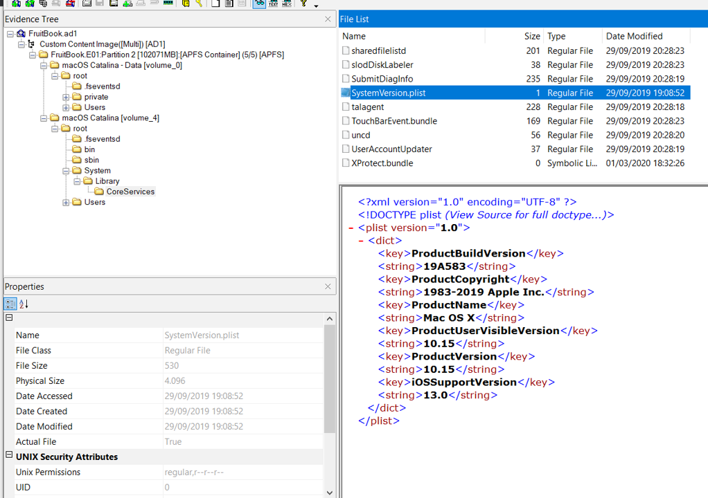
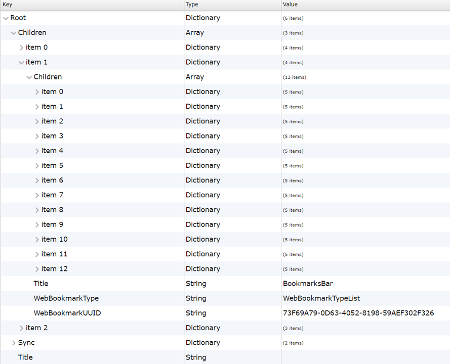

# Spotlight - Cyberdefenders

This is a really good macOS forensics that was presented in Cyberdefenders platform as one of the biggest
blue teaming practice labs to train and sharpen up your analyzing skills.

You may register yourself to the platform and play all the challenges as much as you want.
Here's my findings on how to solve it.


# Preliminary

In order to complete this challenge, you may want to download these tools:
- [mac_apt](https://github.com/ydkhatri/mac_apt)
- [DB Browser for SQLite](https://sqlitebrowser.org/)
- [FSEvent Parser](https://github.com/dlcowen/FSEventsParser)
- [FTK Imager](https://accessdata.com/product-download)
- [iBackUp Viewer -> Plist Viewer Tools](https://www.imactools.com/iphonebackupviewer/download/win)
- [Steghide](http://steghide.sourceforge.net/) 

Note that there are many tools that can be varied and used to be an alternative one replacing one which
I've mentioned above.

# Integrity Check

Once you've dowloaded the file given, make sure to check the integrity of the files using the hashcheck
feature in `FTK Imager`. Since we are dealing with `.ad1` file, FTK shall be my first option.

You can open it and refer to `File -> Add Evidence Item -> Image File -> <Your .ad1 location file>`.
There'll be a small icon of the filenames and to do a quick integrity check, right-click the icon
and click `Verify the Drive/Image`. 


The result shall be like this:


Check the hash out from the `FruitBook.txt` to match the hash whether it's equal or not, then if it's equal,
you're good to go! If it's not, the downloaded files probably got corrupted.

# Challenges

## 1. What version of macOS is running on this image?

To locate the version of the macOS image, you may proceed to `System/Library/CoreServices/SystemVersion.plist`.
Plist file is a settings file where you can carve some essential information from it.



FTK Imager may read the `.plist` file to readable ones if the size is not too big, but we'll meet the case once
the `.plist` file starts to have larger scheme of information later on the questions.

As we can see, the version of this macOS is **10.15**. Note that the System folder refers to the `macOS Catalina [volume_4]`.

## 2. What "competitive advantage" did Hansel lie about in the file AnotherExample.jpg?

We may want to explore more on the image since files can be located anywhere, I started to look around on the
personal directory and found out that it's located in `Shared` folder. There are some
image files and one suspicious file called `secret` which reveals the "competitive advantage" which
somehow is non-sense, it's a **flip phone**.


We can interpret that whoever owns this macOS, might be a **fraud**.

## 3. How many bookmarks are registered in safari?

Safari is a web browser, so we have to traverse throught the Safari Directory and find some artifacts related to the
Bookmarks. It may be a database or a `.plist` file again.
You may find it on `/root/Users/hansel.apricot/Library/Safari/Bookmarks.plist`.

As you can see this time, FTK couldn't read the `.plist` into readable format. We have to download the 
`Bookmarks.plist` by right-clicking it and `Export Files` to your destination directory, and in my case,
I put it on the same one with `.ad1` file.


To read it, we can use one of the tools that I mentioned above, `iBackupViewer`, that has a feature to read it.


If you managed to open it on your first time, the property list viewer feature is located on the "3-dash" icons on
the top-left.

Once the pop-ups have arrived, open the Bookmarks.plist file that you've exported to the same directory of the
`.ad1` file.



All the bookmarked URLs are located on the `item 1` childkey. As you can see that each of the bookmarks has 5 sub-items
that listed for general information. How do I know the `item 1` is responsible for holding all the bookmarks?
The `.plist` structure is almost like a `JSON` format or `Registry` format, so it has parents and child, with a 
values and key. One of the values refer as `Title` which states `BookmarksBar`.

Therefore, the total bookmark is 13 (as in total of Children items).

## 4. What's the content of the note titled "Passwords"?

When it comes into notes, macOS has its own feault Note Apps and we can carve some artifacts from there in its own database
located in `/root/Users/hansel.apricot/Library/Group Containers/group.com.apple.notes/NoteStore.sqlite`.

In order to clearly parse the content, we may use another tools that I stated, `mac_apt`.
`mac_apt_artifact_only.exe -i D:\cyberdefenders\c18-spotlight\NoteStore.sqlite -o D:\cyberdefenders\c18-spotlight\mac_artifact_only NOTES`
The final option of mac_apt that needs to be fulfilled as parameter is plugin, and we use **NOTES** as our plugin to parse the note apps database.

Once it succeed, open the destination folder where you may find `mac_apt.db` as the parsed database file.
We can use `DB Browser` tools to read it or you may want to use another database reader.


Refer to `Browse Data` options and you may find the Notes titled `Passwords` which also contains `Passwords`.

## 5. Provide the MAC address of the ethernet adapter for this machine.

To find the MAC Address, we can refer to `/private/var/log/daily.out` where it stores the network's interface
that was used in macOS.


The ethernet hardware device in Linux usually comes up with `eth0`, but in macOS, it's `en0`. So the MAC Address is
`00:0c:29:c4:65:77`.

## 6. Name the data URL of the quarantined item.

Quarantined Items in macOS often categorized as a malicious file that needs to be authorized by you as the
privileged user to approve that it's YOU that download the file from the outside official apps, such
as internet and etc.

Since it was from internet, there's an interesting macOS artifact called `Quarantine Events` which you may
use to see the source URL of the downloaded items.
In this case, it's located in `/root/Users/sneaky/Library/Preferences/com.apple.LaunchServices.QuarantineEventsV2` and
it's a SQLite database file. We had to export the files again.


After that, We read the database using the `DB Browser` just like before.


LSQuarantineDataURLString column is the data URL of the quarantined items, with a value: `https://futureboy.us/stegano/encode.pl`.

## 7. What app did the user "sneaky" try to install via a .dmg file?

It's pretty obvious, where we can traverse to the **sneaky** folders and turns out it was
deleted. The `.dmg` file is located on the `.Trash` folder (`/root/Users/sneaky/.Trash`).


The app is **silenteye**.

## 8. What was the file 'Examplesteg.jpg' renamed to?

We are now dealing with the log events where we had to see the file's permission. Why do we deal with it? In macOS, the
file's permission flags may consist of `Modified`, `Created`, `Renamed`, and etc. The file event logs are located in `.fseventsd`
folder on [volume_0]. The folder is approximately 150 mb.
In this case, we have to parse it and use `FSEvent` tools.

`.\FSEParser_V4.exe -s D:\cyberdefenders\c18-spotlight\.fseventsd -o D:\cyberdefenders\c18-spotlight\mac_artifact_fsevent -t folder`

Once they are parsed, we'll see the FSE_Reports with a `.sqlite` file inside. The DB will be loaded for awhile and 
you have to filter out the column that consists data `Examplesteg.jpg`. After it succeeds to filter, **copy the node_id column value** 
and redo the same thing filtering out the column with the node_id now. You will find a `Renamed;` flags with a new name of
Examplesteg.jpg, which is `GoodExample.jpg`.


## 9. How much time was spent on mail.zoho.com on 4/20/2020?

In macOS, there's a `Screen Time Agent` that responsibles to count how much time was spent on the apps
that you used. To carve the information about it, refer to `/root/private/var/folders/bf/r04p_gb17xxg37r9ksq855mh0000gn/0/com.apple.ScreenTimeAgent/Store/RMAdminStore.sqlite`.
Note that if you find the `.sqlite` files with some other similar files like `sqlite-shm` and `sqlite-wal`, you'll also need to download it since they
are a part of shared memory cache of the main sqlite data.


Now we have to use `mac_apt` again to parse and beautify the DB Data with `SCREENTIME` plugin.
`mac_apt_artifact_only.exe -i D:\cyberdefenders\c18-spotlight\RMAdminStore-Local.sqlite -o D:\cyberdefenders\c18-spotlight\mac_artifact_screentime SCREENTIME`

Open up the `mac_apt.db` in the destination folder and we can see that on **4/20/2020**, there are two activities that spent the same apps on `mail.zoho.com`,
with the first one is 4 minutes 34 seconds, and the second one is 16 minutes 24 seconds. Summing the total time is `20 minutes 58 seconds` or `20:58`.


## 10. What's hansel.apricot's password hint?

Now we're referring to the user's profile, we may find the `.plist` file about the all the users in
`/var/db/dslocal/nodes/Default/users/<their username/names>.pslist`.


We exported the files again and read the `.plist` file through `iBackupViewer` again. The password hint for the users
is located on the `hint` values. In this case, it's `Family Opinion`.


## 11. The main file that stores Hansel's iMessages had a few permissions changes. How many times did the permissions change?

To see the permission changes, we have to refer to the `.fseventsd` folder again and find out the artifact file that flagged as
`PermissionChanged`. Since the `iMessage` database are located in `Users/<username>/Library/Messages/chat.db`, in this case we
may refer to `hansel.apricot` -> `Users/hansel.apricot/Library/Messages/chat.db`.
Open up the same `FSEvents.sqlite` file and filter the column that consists of `Users/hansel.apricot/Library/Messages/chat.db` data.


Pay attention to the `PermissionChanged` flags, we may count it all and `7` permission changes have occured.

## 12. What's the UID of the user who is responsible for connecting mobile devices?

All multi devices connection goes from `usbmuxd`. Therefore, we do the same methodology just like in the **Question 10**.
The UID of `usbmuxd` is `213`.

## 13. Find the flag in the GoodExample.jpg image. It's hidden with better tools.

We navigate back to the `secret` folder again and download `GoodExample.jpg`. After that, use `Steghide` to parse the hidden
file which embedded inside of the image.
The content had a flag signature on it which is `helicopter`.

```bash
steghide extract -sf GoodExample.jpg --passphrase ""
wrote extracted data to "steganopayload27635.txt".

cat steganopayload27635.txt
Our latest phone will have flag<helicopter> blades and 6 cameras on it. No
other phone has those features!%
```

## 14. What was exactly typed in the Spotlight search bar on 4/20/2020 02:09:48

Just like a search bar in Windows, `Spotlight` is another univeral search bar in macOS to find out which files are located so users can only
type the filename easily and let the `Spotlight` filters out the files that you want to see or open.
This may be also an interesting artifact for the forensicator to track what files are being opened or executed by the adversaries.

To parse the spotlight history, refer to `/Users/sneaky/Library/Application Support/com.apple.spotlight.Shortcuts`. 
The file is originally an `XML` format so it's readable.

```xml
<?xml version="1.0" encoding="UTF-8"?>
<!DOCTYPE plist PUBLIC "-//Apple//DTD PLIST 1.0//EN" "http://www.apple.com/DTDs/PropertyList-1.0.dtd">
<plist version="1.0">
<dict>
	<key>silent</key>
	<dict>
		<key>DISPLAY_NAME</key>
		<string>silenteye-0.4.1b-snowleopard_installer</string>
		<key>LAST_USED</key>
		<date>2020-04-20T02:44:27Z</date>
		<key>URL</key>
		<string>/Applications/silenteye-0.4.1b-snowleopard_installer.app</string>
	</dict>
	<key>term</key>
	<dict>
		<key>DISPLAY_NAME</key>
		<string>Terminal</string>
		<key>LAST_USED</key>
		<date>2020-04-20T02:09:48Z</date>
		<key>URL</key>
		<string>/System/Applications/Utilities/Terminal.app</string>
	</dict>
</dict>
</plist>
```
Since we want it on 4/20/2020 02:09:48, the typed key is `term` and it refers to `Terminal`.

## 15. What is hansel.apricot's Open Directory user UUID?

The methodology used in this question is the same as **Question 10**, but we'll focus more on the `generateduid` since it responsibles holding
the OD User UUID, which is ` 5BB00259-4F58-4FDE-BC67-C2659BA0A5A4`.


