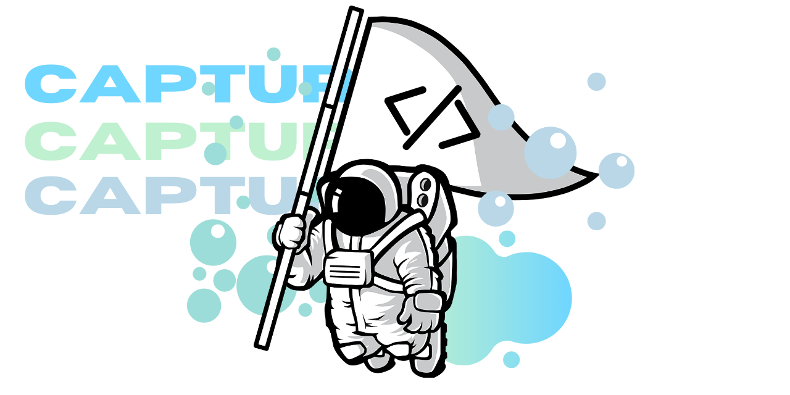

# :triangular_flag_on_post: Capture The Flag

## Intoduction
Have you ever played Capture the Flag before?
The name could be very trivial when it comes into gamers thingy, yet it's different altough
I'd consider CTF as an E-Sport Games!

Capture The Flag is a games designed for all Cybersecurity Enthusiast to learn about catching and analyzing
a vulnerability in a simulated-system which are designed to have a certain vulns that can be exploited. However,
it's not always about finding vulnerabilities or exploiting the system as there are some challenges which are required
to be analyzed in order to find the `flag`.
The `flag` format sometimes has a prefix of the CTF Organizer's name followed by some alphanumerical strings.
 

The game's divided into certain categories:
* Web Exploitation :computer:
* Binary Exploitation :one: :zero:
* Reverse Engineering :beetle:
* Forensics :monocle_face:	
* Cryptography :infinity:	
* OSINT :detective:	
* Misc :zap:	

At the end, the players may make a writeups which contains the progress on how to solve the
certain challenges that were given.
Feel free to read my writeups here! (based on years)

[2021](writeups/test.md)

